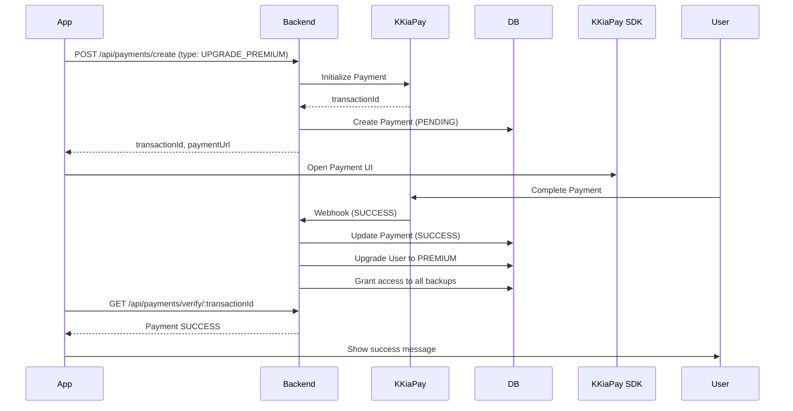
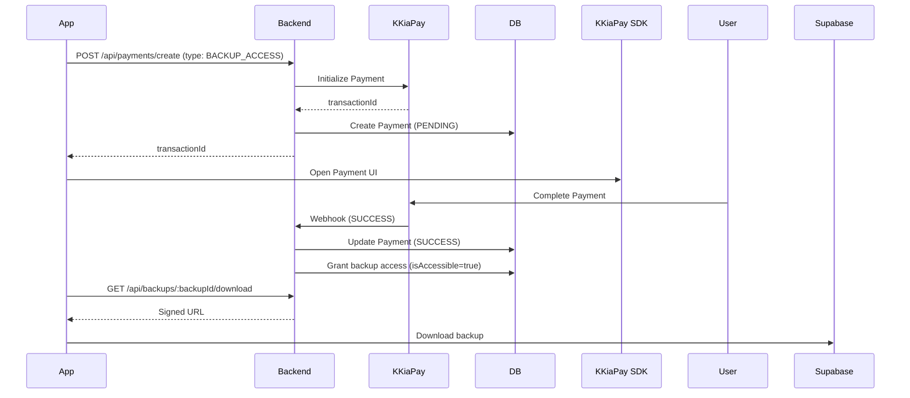

# 💳 Intégration KKiaPay - Lotus Business

## 📋 Vue d'ensemble

Ce document décrit l'intégration complète de **KKiaPay** pour les paiements mobiles dans Lotus Business.

### Méthodes de paiement supportées
- 📱 **Mobile Money** : Wave, Orange Money, MTN Mobile Money, Moov Money
- 💳 **Cartes bancaires** : Visa, Mastercard

### Types de paiements
1. **UPGRADE_PREMIUM** : Upgrade FREE → PREMIUM
2. **RENEW_PREMIUM** : Renouvellement abonnement PREMIUM
3. **BACKUP_ACCESS** : Achat d'accès à un backup pour utilisateurs FREE

---

## 💰 Tarification

| Type | Mensuel | Annuel |
|------|---------|--------|
| **Premium** | 999 FCFA/mois | 10 000 FCFA/an |
| **Backup Access** | 999 FCFA | - |

---

## 🔧 Configuration

### 1. Créer un compte KKiaPay

1. Rendez-vous sur [kkiapay.me](https://kkiapay.me)
2. Créez un compte marchand
3. Accédez au dashboard : [app.kkiapay.me](https://app.kkiapay.me)

### 2. Récupérer les clés API

Dans votre dashboard KKiaPay :
- **Public Key** : Clé publique pour le SDK mobile
- **Private Key** : Clé privée pour les appels API backend
- **Secret** : Secret pour la vérification des webhooks

### 3. Configurer le fichier .env

```env
# KKiaPay Configuration
KKIAPAY_PUBLIC_KEY="pk_xxxxxxxxxxxxxxxxxxxxx"
KKIAPAY_PRIVATE_KEY="sk_xxxxxxxxxxxxxxxxxxxxx"
KKIAPAY_SECRET="secret_xxxxxxxxxxxxxxxxxxxxx"
KKIAPAY_SANDBOX="true"  # false en production
```

⚠️ **Important** : En production, configurez `KKIAPAY_SANDBOX="false"`

### 4. Configurer le Webhook

Dans votre dashboard KKiaPay, configurez l'URL du webhook :

```
https://votre-domaine.com/api/payments/webhook
```

Le webhook sera appelé automatiquement lors de la confirmation d'un paiement.

---

## 🛠️ Architecture

### Modèle de données

```prisma
model Payment {
  id            String        @id @default(cuid())
  userId        String
  user          User          @relation(fields: [userId], references: [id])
  amount        Int           // Montant en FCFA
  currency      String        @default("XOF")
  type          PaymentType   // UPGRADE_PREMIUM, RENEW_PREMIUM, BACKUP_ACCESS
  status        PaymentStatus // PENDING, SUCCESS, FAILED, REFUNDED
  transactionId String?       @unique
  method        String?       // wave, mtn, orange, moov, visa, mastercard
  metadata      Json?
  createdAt     DateTime      @default(now())
  updatedAt     DateTime      @updatedAt
  completedAt   DateTime?
}

enum PaymentType {
  UPGRADE_PREMIUM
  RENEW_PREMIUM
  BACKUP_ACCESS
}

enum PaymentStatus {
  PENDING
  SUCCESS
  FAILED
  REFUNDED
}
```

### Fichiers créés

```
server/
├── src/
│   ├── services/
│   │   └── kkiapayService.js      # Service KKiaPay
│   ├── controllers/
│   │   └── paymentController.js    # Contrôleur paiements
│   └── routes/
│       └── payments.js             # Routes paiements
├── prisma/
│   └── schema.prisma               # Modèle Payment ajouté
└── KKIAPAY_INTEGRATION.md          # Cette documentation
```

---

## 🔗 API Routes

### Routes utilisateur (authentification requise)

#### 1. Créer un paiement
```http
POST /api/payments/create
Authorization: Bearer <jwt_token>
Content-Type: application/json

{
  "type": "UPGRADE_PREMIUM",
  "subscriptionType": "MONTHLY", // ou "ANNUAL"
  "phone": "+22990000000"         // Optionnel (utilise le phone du user par défaut)
}
```

**Réponse :**
```json
{
  "message": "Paiement initialisé",
  "payment": {
    "id": "clxxx...",
    "userId": "xxx",
    "amount": 999,
    "type": "UPGRADE_PREMIUM",
    "status": "PENDING",
    "transactionId": "kkiapay_transaction_id"
  },
  "transactionId": "kkiapay_transaction_id",
  "paymentUrl": "https://pay.kkiapay.me/xxx"
}
```

#### 2. Vérifier un paiement
```http
GET /api/payments/verify/:transactionId
Authorization: Bearer <jwt_token>
```

**Réponse :**
```json
{
  "message": "Paiement confirmé",
  "payment": {
    "id": "clxxx...",
    "status": "SUCCESS",
    "completedAt": "2026-08-02T10:00:00.000Z"
  },
  "status": "SUCCESS"
}
```

#### 3. Historique des paiements
```http
GET /api/payments/history
Authorization: Bearer <jwt_token>
```

**Réponse :**
```json
{
  "count": 3,
  "payments": [
    {
      "id": "clxxx...",
      "amount": 999,
      "type": "UPGRADE_PREMIUM",
      "status": "SUCCESS",
      "createdAt": "2026-08-02T10:00:00.000Z"
    }
  ]
}
```

### Routes admin (authentification admin requise)

#### 4. Tous les paiements
```http
GET /api/payments/admin/all?status=SUCCESS&limit=100
Authorization: Bearer <admin_jwt_token>
```

**Réponse :**
```json
{
  "count": 50,
  "payments": [...],
  "stats": [
    { "status": "SUCCESS", "_count": 45, "_sum": { "amount": 44955 } },
    { "status": "PENDING", "_count": 5, "_sum": { "amount": 4995 } }
  ]
}
```

#### 5. Accorder accès backup manuellement
```http
POST /api/payments/admin/grant-backup-access
Authorization: Bearer <admin_jwt_token>
Content-Type: application/json

{
  "backupId": "clxxx...",
  "userId": "xxx"
}
```

### Webhook (public, avec vérification de signature)

#### 6. Webhook KKiaPay
```http
POST /api/payments/webhook
X-KKiaPay-Signature: sha256_signature
Content-Type: application/json

{
  "transactionId": "xxx",
  "status": "SUCCESS",
  "amount": 999,
  "method": "wave",
  ...
}
```

---

## 📱 Intégration Mobile (React Native)

### 1. Installation

```bash
npm install kkiapay-sdk
```

### 2. Exemple d'implémentation

```javascript
import { KKiaPay } from 'kkiapay-sdk';

// Configuration
const kkiapay = new KKiaPay({
  publicKey: 'pk_xxxxxxxxxxxxxxxxxxxxx',
  sandbox: true, // false en production
});

// Fonction de paiement
async function upgradeToPremium(subscriptionType = 'MONTHLY') {
  try {
    // 1. Créer une intention de paiement sur le backend
    const response = await fetch('https://your-api.com/api/payments/create', {
      method: 'POST',
      headers: {
        'Content-Type': 'application/json',
        'Authorization': `Bearer ${userToken}`,
      },
      body: JSON.stringify({
        type: 'UPGRADE_PREMIUM',
        subscriptionType,
      }),
    });

    const { payment, transactionId, paymentUrl } = await response.json();

    // 2. Ouvrir l'interface de paiement KKiaPay
    const result = await kkiapay.requestPayment({
      amount: payment.amount,
      reason: subscriptionType === 'ANNUAL' 
        ? 'Abonnement Premium Annuel' 
        : 'Abonnement Premium Mensuel',
      phone: user.phone,
      email: user.email,
      firstName: user.firstName,
      lastName: user.lastName,
    });

    // 3. Vérifier le paiement sur le backend
    const verifyResponse = await fetch(
      `https://your-api.com/api/payments/verify/${transactionId}`,
      {
        headers: {
          'Authorization': `Bearer ${userToken}`,
        },
      }
    );

    const { status, payment: updatedPayment } = await verifyResponse.json();

    if (status === 'SUCCESS') {
      Alert.alert('Succès', 'Votre compte a été upgradé vers Premium !');
      // Rafraîchir les données utilisateur
      await refreshUserData();
    } else {
      Alert.alert('En attente', 'Le paiement est en cours de traitement...');
    }

  } catch (error) {
    console.error('Erreur paiement:', error);
    Alert.alert('Erreur', 'Une erreur est survenue lors du paiement');
  }
}

// Utilisation
<Button 
  title="Upgrade vers Premium (999 FCFA/mois)"
  onPress={() => upgradeToPremium('MONTHLY')}
/>

<Button 
  title="Upgrade vers Premium (10 000 FCFA/an)"
  onPress={() => upgradeToPremium('ANNUAL')}
/>
```

### 3. Acheter l'accès à un backup

```javascript
async function buyBackupAccess(backupId) {
  try {
    // 1. Créer une intention de paiement
    const response = await fetch('https://your-api.com/api/payments/create', {
      method: 'POST',
      headers: {
        'Content-Type': 'application/json',
        'Authorization': `Bearer ${userToken}`,
      },
      body: JSON.stringify({
        type: 'BACKUP_ACCESS',
        backupId,
      }),
    });

    const { payment, transactionId } = await response.json();

    // 2. Ouvrir l'interface de paiement
    await kkiapay.requestPayment({
      amount: 999,
      reason: 'Accès Backup Lotus Business',
      phone: user.phone,
      email: user.email,
    });

    // 3. Vérifier le paiement
    const verifyResponse = await fetch(
      `https://your-api.com/api/payments/verify/${transactionId}`,
      {
        headers: {
          'Authorization': `Bearer ${userToken}`,
        },
      }
    );

    const { status } = await verifyResponse.json();

    if (status === 'SUCCESS') {
      Alert.alert('Succès', 'Vous pouvez maintenant télécharger votre backup !');
      // Télécharger le backup
      await downloadBackup(backupId);
    }

  } catch (error) {
    console.error('Erreur:', error);
    Alert.alert('Erreur', 'Une erreur est survenue');
  }
}
```

---

## 🔄 Workflow de paiement

### 1. Upgrade FREE → PREMIUM



### 2. Achat accès backup



---

## 🧪 Tests

### Migration de la base de données

```bash
cd server
npx prisma migrate dev --name add_payment_model
npx prisma generate
```

### Test avec Postman

#### 1. Créer un paiement (utilisateur FREE)

```
POST http://localhost:5000/api/payments/create
Authorization: Bearer <user_jwt_token>
Content-Type: application/json

{
  "type": "UPGRADE_PREMIUM",
  "subscriptionType": "MONTHLY"
}
```

#### 2. Vérifier le paiement

```
GET http://localhost:5000/api/payments/verify/<transactionId>
Authorization: Bearer <user_jwt_token>
```

#### 3. Simuler un webhook (mode sandbox)

```
POST http://localhost:5000/api/payments/webhook
X-KKiaPay-Signature: <signature>
Content-Type: application/json

{
  "transactionId": "xxx",
  "status": "SUCCESS",
  "amount": 999,
  "method": "wave"
}
```

---

## 🛡️ Sécurité

### 1. Vérification de signature webhook

Le webhook vérifie la signature HMAC-SHA256 pour garantir l'authenticité :

```javascript
const crypto = require('crypto');

function verifySignature(signature, payload, secret) {
  const hash = crypto
    .createHmac('sha256', secret)
    .update(JSON.stringify(payload))
    .digest('hex');
  
  return hash === signature;
}
```

### 2. Validation des montants

Le backend vérifie que les montants correspondent aux tarifs définis :
- Premium mensuel : **999 FCFA**
- Premium annuel : **10 000 FCFA**
- Accès backup : **999 FCFA**

### 3. Authentification JWT

Toutes les routes (sauf webhook) nécessitent un token JWT valide.

---

## 📊 Statistiques et suivi

### Dashboard admin - Vue paiements

Le dashboard admin pourra afficher :
- Nombre total de paiements
- Revenus par période
- Taux de conversion FREE → PREMIUM
- Méthodes de paiement les plus utilisées
- Paiements en attente / échoués

### Requêtes SQL utiles

```sql
-- Revenus totaux
SELECT SUM(amount) FROM payments WHERE status = 'SUCCESS';

-- Paiements par méthode
SELECT method, COUNT(*), SUM(amount) 
FROM payments 
WHERE status = 'SUCCESS' 
GROUP BY method;

-- Taux de conversion
SELECT 
  (SELECT COUNT(*) FROM users WHERE "licenseType" = 'PREMIUM') * 100.0 / 
  (SELECT COUNT(*) FROM users) AS conversion_rate;
```

---

## 🚀 Déploiement en production

### Checklist

- [ ] Configurer les clés KKiaPay de production
- [ ] Définir `KKIAPAY_SANDBOX="false"` dans .env
- [ ] Configurer l'URL du webhook dans le dashboard KKiaPay
- [ ] Tester le flux complet en mode production
- [ ] Activer le monitoring des webhooks
- [ ] Configurer les alertes pour paiements échoués

---

## 📞 Support

### Documentation KKiaPay
- [Documentation officielle](https://docs.kkiapay.me)
- [API Reference](https://docs.kkiapay.me/api)
- [SDK React Native](https://www.npmjs.com/package/kkiapay-sdk)

### Contact KKiaPay
- Email : support@kkiapay.me
- Dashboard : [app.kkiapay.me](https://app.kkiapay.me)

---

## 🔄 Prochaines étapes

1. **Dashboard admin** : Créer une page de gestion des paiements
2. **Notifications** : Envoyer des emails de confirmation de paiement
3. **Remboursements** : Implémenter la logique de remboursement
4. **Coupons** : Système de codes promo
5. **Analytics** : Tracking détaillé des conversions

---

**Version** : 1.0.0  
**Date** : 2 août 2026  
**Auteur** : Lotus Business Team
